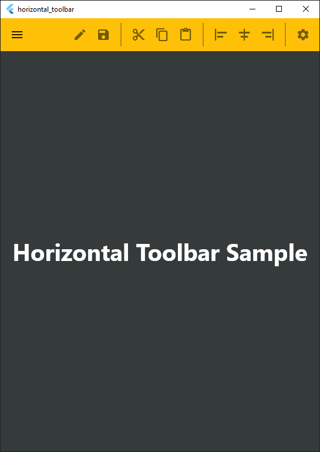

# Samples

## [horizontal_toolbar](horizontal_toolbar/)

* This sample shows a typical toolbar with separator, that is common in desktop environments like Windows or macOS

---
[Home](../README.md)
