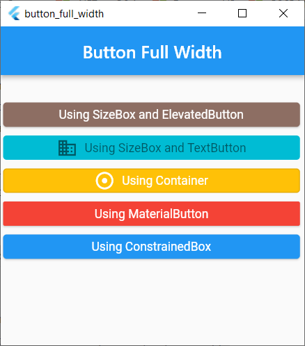
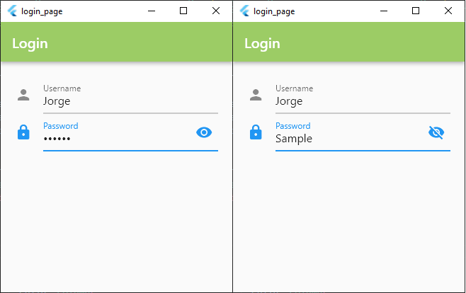

# General Samples
- [`Add or Remove an element`](#add_or_remove_an_element)
- [`Alert Dialog Box`](#alert_dialog_box)
- [`Animated Builder`](#animated_builder)
- [`Animated Cross Fade`](#animated_cross_fade)
- [`Animated Default Text Style`](#animated_default_text_style)
- [`Bottom Navigation Bar`](#bottom_navigation_bar)
- [`Button Full Width`](#button_full_width)
- [`Button Multiple Toggle Switch`](#button_multiple_toggle_switch)
- [`Button Toggle Switch`](#button_toggle_switch)
- [`Calculator`](#calculator)
- [`Circular Loading Indicator`](#circular_loading_indicator)
- [`Combo Box`](#combo_box)
- [`Date Picker`](#date_picker)
- [`Dialog Box with 2 buttons`](#dialog_box_with_2_buttons)
- [`Dialog Box with 3 buttons`](#dialog_box_with_3_buttons)
- [`Form Dialog Box`](#form_dialog_box)
- [`Future`](#future)
- [`Horizotal Toolbar`](#horizontal_toolbar)
- [`Http Get and Post`](#http_get_and_post)
- [`Icon Text`](#icon_text)
- [`Linear Loading Indicator`](#linear_loading_indicator)
- [`ListTile with Rounded Borders`](#listtile_with_rounded_borders)
- [`Load Base64 Image`](#load_base64_image)
- [`Load JSON File`](#load_json_file)
- [`Load SVG Image`](#load_svg_image)
- [`Login Page`](#login_page)
- [`Login Page With Release`](#login_page_with_release)
- [`Markdown Text`](#markdown_text)
- [`Opacity`](#opacity)
- [`Opacity with Linear Gradient`](#opacity_with_linear_gradient)
- [`Play Sound File`](#play_sound_file)
- [`Rating`](#rating)
- [`Rounded Bottom Navigation Bar`](#rounded_bottom_navigation_bar)
- [`Routes`](#routes)
- [`Sqlite Sample`](#sqlite_sample)
- [`Switch Button`](#switch_button)
- [`Switch Cover Button`](#switch_cover_button)
- [`Text Field Search Box`](#text_field_search_box)
- [`ToDo List`](#todo_list)

## [**add_or_remove_an_element**](add_or_remove_an_element/lib/main.dart)
This sample shows how to add or remove an element based in a toggle

> <a href="https://dartpad.dev/ccf67c5da89d785b0104ecb5d0e1a21f" target="_blank">Code in action using DartPad</a>

## [**alert_dialog_box**](alert_dialog_box/lib/main.dart)
This sample shows a typical Alert Dialog Box

> <a href="https://dartpad.dev/d82f3f5a13246ecf8daa1ae22adfabfe" target="_blank">Code in action using DartPad</a>

## [**animated_builder**](animated_builder/lib/main.dart)
This sample shows a simple animation in a Flutter App

> <a href="https://dartpad.dev/060beb5588342fce5b7f4592200cd807" target="_blank">Code in action using DartPad</a>

## [**animated_cross_fade**](animated_cross_fade/lib/main.dart)
This sample shows a simple animation using `AnimatedCrossFade`

> <a href="https://dartpad.dev/72bc06fbca7ad156c56e5f3594a773a8" target="_blank">Code in action using DartPad</a>

## [**animated_default_text_style**](animated_default_text_style/lib/main.dart)
This sample shows a text animated using `AnimatedDefaultTextStyle`

> <a href="https://dartpad.dev/e826633a2c7c79f42ba0755afbc55497" target="_blank">Code in action using DartPad</a>

## [**bottom_navigation_bar**](bottom_navigation_bar/lib/main.dart)
This sample shows a typical Bottom Navigation Bar

> <a href="https://dartpad.dev/063161a922c5dc09eb9e81bff21c1cd6" target="_blank">Code in action using DartPad</a>

## [**button_full_width**](button_full_width/lib/main.dart)
This sample shows some buttons with a full width

> <a href="https://dartpad.dev/7e7d8a3c84614757c6aafcfa0fa3d8cd" target="_blank">Code in action using DartPad</a>

## [**button_multiple_toggle_switch**](button_multiple_toggle_switch/lib/main.dart)
This sample shows a toggle switch with a multiple selection

> <a href="https://dartpad.dev/314c2d5409ceb5c01d9997751a52317b" target="_blank">Code in action using DartPad</a>

## [**button_toggle_switch**](button_toggle_switch/lib/main.dart)
This sample shows a toggle switch with a single selection

> <a href="https://dartpad.dev/0460832521b5009486468569905fe3a4" target="_blank">Code in action using DartPad</a>

## [**calculator**](calculator/lib/main.dart)
This sample shows a typical and simple Calculator

[**Calculator class used in the sample**](calculator/lib/calculator.dart)

> <a href="https://dartpad.dev/1f930efd3c77185c0f851e6d15a0b3f6" target="_blank">Code in action using DartPad</a>

## [**circular_loading_indicator**](circular_loading_indicator/lib/main.dart)
This sample shows a Circular Loading Indicator

> <a href="https://dartpad.dev/8d58bcec8dfc2e91cfa815ed1395c4bf" target="_blank">Code in action using DartPad</a>

## [**combo_box**](combo_box/lib/main.dart)
This sample shows a typical Combo Box

> <a href="https://dartpad.dev/eafb5c4a2c40e3953b57b46ef329ffdc" target="_blank">Code in action using DartPad</a>

## [**date_picker**](date_picker/lib/main.dart)
This sample shows a typical Date Picker

> <a href="https://dartpad.dev/ecd28770a55d267e2fb5541ffeafdc07" target="_blank">Code in action using DartPad</a>

## [**dialog_box_with_2_buttons**](dialog_box_with_2_buttons/lib/main.dart)
This sample shows a typical Dialog Box with 2 buttons (cancel, accept)

> <a href="https://dartpad.dev/4e21c4ef2c96c7a6f21d892a5b2a9e86" target="_blank">Code in action using DartPad</a>

## [**dialog_box_with_3_buttons**](dialog_box_with_3_buttons/lib/main.dart)
This sample shows a typical Dialog Box with 3 buttons (cancel, no, yes)

> <a href="https://dartpad.dev/13c96614ce1c71926ed74f066927f2ac" target="_blank">Code in action using DartPad</a>

## [**form_dialog_box**](form_dialog_box/lib/main.dart)
This sample shows a Form Dialog Box to fill in some data to do something with it 

> <a href="https://dartpad.dev/e1246c67f595e208538673ac0c36beb5" target="_blank">Code in action using DartPad</a>

## [**future**](future/lib/main.dart)
This code shows a use of Future simulating an async task

> <a href="https://dartpad.dev/7d7614e19322a210b6837ccd9a59facc" target="_blank">Code in action using DartPad</a>

## [**horizontal_toolbar**](horizontal_toolbar/lib/main.dart)
This sample shows a typical toolbar with separator, that is common in desktop environments like Windows or macOS

> <a href="https://dartpad.dev/102a5229ab86981fa88e506f471f0727" target="_blank">Code in action using DartPad</a>

## [**http_get_and_post**](http_get_and_post/lib/main.dart)
This sample uses GetX to connect and do a get, post, etc connection with an API

## [**icon_text**](icon_text/lib/main.dart)
This sample shows a typical button that includes an image and text

> <a href="https://dartpad.dev/0fcac56090c56d01cbb2b6d38bc0cc43" target="_blank">Code in action using DartPad</a>

## [**linear_loading_indicator**](linear_loading_indicator/lib/main.dart)
This sample shows a Linear Loading Indicator

> <a href="https://dartpad.dev/f47d45270c1a8c3d57baf89544416942" target="_blank">Code in action using DartPad</a>

## [**listtile_with_rounded_borders**](listtile_with_rounded_borders/lib/main.dart)
This sample shows a ListTile with Rounded Borders

> <a href="https://dartpad.dev/65dfc89e8bb9e084871065cf147165a6" target="_blank">Code in action using DartPad</a>

## [**load_base64_image**](load_base64_image/lib/main.dart)
This sample load some base64 images in execution time

> <a href="https://dartpad.dev/c56ee4745fcaab99c537083ed66a2a66" target="_blank">Code in action using DartPad</a>

## [**load_json_file**](load_json_file/lib/main.dart)
This sample load a JSON file in execution time (see the assets folder with the JSON file, and the pubspec.yaml file)

> [Icons used in the sample](https://api.flutter.dev/flutter/material/Icons-class.html)

## [**load_svg_image**](load_svg_image/lib/main.dart)
This sample shows as to Play a mp3 sound file in Flutter

This sample uses the [flutter_svg](https://pub.dev/packages/flutter_svg) package to Load SVG Images

## [**login_page**](login_page/lib/main.dart)
Login Page showing and hiding the password with a click

> <a href="https://dartpad.dev/4f19dc5e2b39709934ec72a6ed1eb71b" target="_blank">Code in action using DartPad</a>

## [**login_page_with_release**](login_page_with_release/lib/main.dart)
Login Page showing and hiding the password with a click and release action

> <a href="https://dartpad.dev/224ac4ee722f11dded4a75e07138f94b" target="_blank">Code in action using DartPad</a>

## [**markdown_text**](markdown_text/lib/main.dart)
This sample shows as to show markdown texts in your Flutter app

This sample uses the [flutter_markdown](https://pub.dev/packages/flutter_markdown) package to Load Markdown texts

## [**opacity**](opacity/lib/main.dart)
This code shows you how to use the Opacity widget in Flutter

> <a href="https://dartpad.dev/a45796cc3efa14b86b82fb8303c43ce6" target="_blank">Code in action using DartPad</a>

## [**opacity_with_linear_gradient**](opacity_with_linear_gradient/lib/main.dart)
This code shows you how to use the Opacity widget with Linear Gradient in Flutter

> <a href="https://dartpad.dev/2a37fd8a059fdde1037721a19f2cc93c" target="_blank">Code in action using DartPad</a>

## [**play_sound_file**](play_sound_file/lib/main.dart)
This sample shows as to Play a mp3 sound file in Flutter

This sample uses the [audioplayers](https://pub.dev/packages/audioplayers) package to Play the sound

## [**rating**](rating/lib/main.dart)
- [**rating component**](rating/lib/components/rating.dart)
This sample shows a Rating component, and an app using it

> <a href="https://dartpad.dev/65d27765e52b3d1dd9d4a2b72d570f54" target="_blank">Code in action using DartPad</a>

## [**rounded_bottom_navigation_bar**](rounded_bottom_navigation_bar/lib/main.dart)
This sample shows a Rounded Bottom Navigation Bar

> <a href="https://dartpad.dev/5e94bb2700dc0b76aba0e99e8e2b3ff5" target="_blank">Code in action using DartPad</a>

## [**routes**](routes/lib/main.dart)
Use of two `Routes` (Pages or Screens in Flutter)

> <a href="https://dartpad.dev/3e1e407ed2048b52fcc0c4452d2dbc4f" target="_blank">Code in action using DartPad</a>

## [**sqlite_sample**](sqlite_sample/lib/main.dart)
This sample shows a typical Sqlite sample with CRUD (create, read, update and delete) actions

This sample uses [sqflite](https://pub.dev/packages/sqflite) and [sqflite_common_ffi](https://pub.dev/packages/sqflite_common_ffi) packages to connect and use Sqlite

## [**switch_button**](switch_button/lib/main.dart)
- [**switch_button component**](switch_button/lib/components/switch_button.dart)

This sample shows a typical Switch Button

> <a href="https://dartpad.dev/ab58fc1bc7017a361521cc93f8f66ecf" target="_blank">Code in action using DartPad</a>

## [**switch_cover_button**](switch_cover_button/lib/main.dart)
- [**switch_cover_button component**](switch_cover_button/lib/components/switch_cover_button.dart)

This sample shows a typical Switch Button but using the [Cupertino Widget](https://docs.flutter.dev/development/ui/widgets/cupertino)

> <a href="https://dartpad.dev/2c73c0a578acd28adb5724cb65dbae64" target="_blank">Code in action using DartPad</a>

## [**text_field_search_box**](text_field_search_box/lib/main.dart)
This sample shows a typical Text Field Search Box used in app to search information

> <a href="https://dartpad.dev/01bd8c54f29b1255ee5a4565e2b97f0d" target="_blank">Code in action using DartPad</a>

## [**todo_list**](todo_list/lib/main.dart)
This sample shows a typical ToDo App

---
[Home](../README.md)
