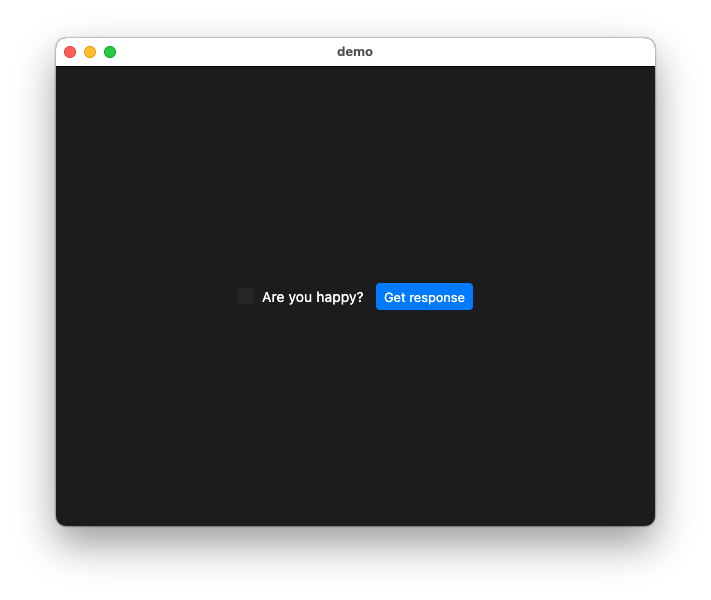
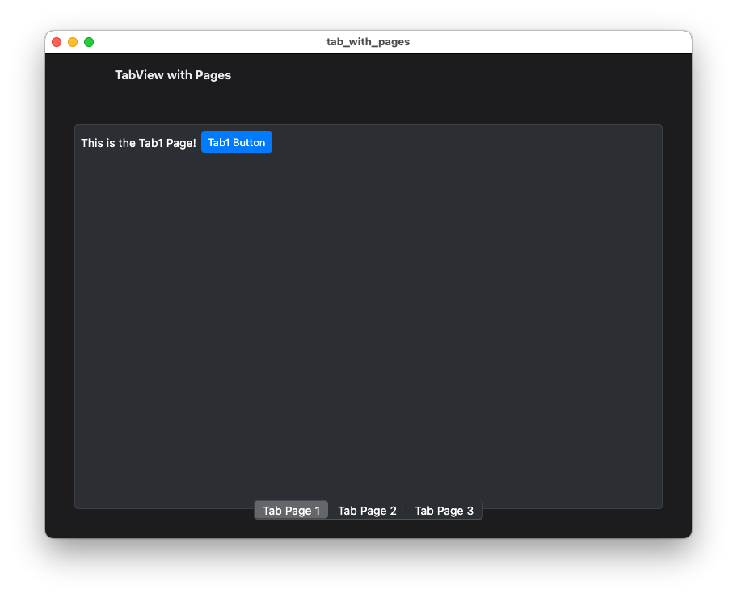
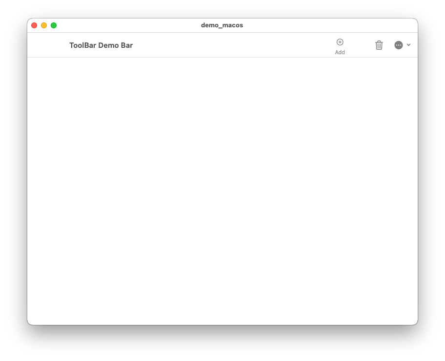
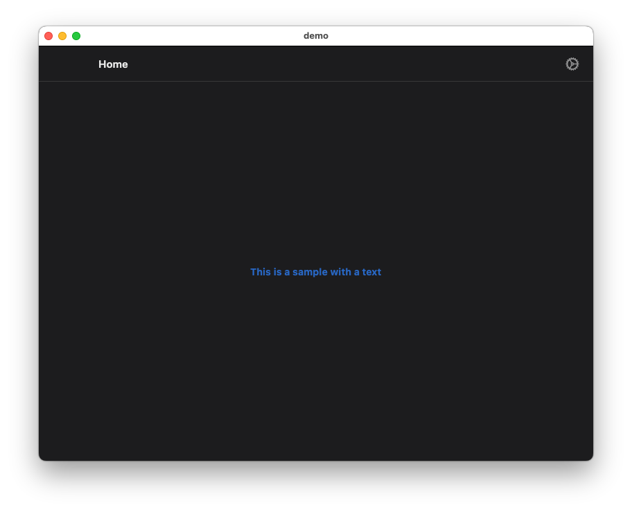
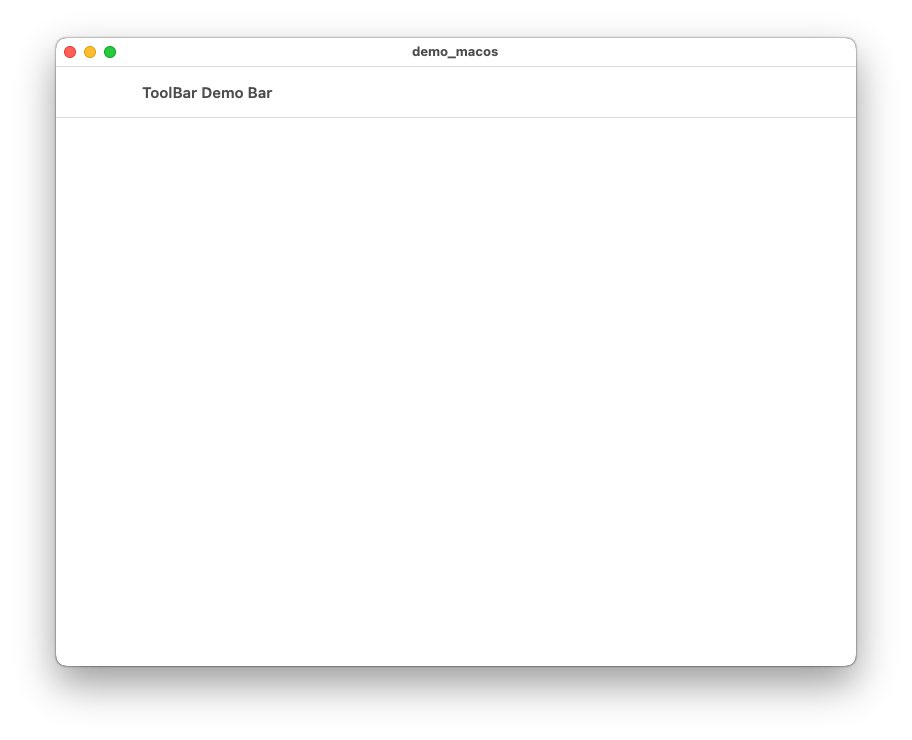

# macOS Samples
- [`CheckBox with button`](#checkbox_with_button)
- [`Tab with pages`](#tab_with_pages)
- [`ToolBar with buttons`](#toolbar_with_buttons)
- [`ToolBar with text in the center`](#toolbar_with_text_in_the_center)
- [`ToolBar with text only`](#toolbar_with_text_only)

## [**CheckBox with button**](macOS/checkbox_with_button/lib/main.dart)
macOS sample of a CheckBox with a Button

## [**Tab with pages**](macOS/tab_with_pages/lib/main.dart)
macOS sample of a Tab with Pages

## [**ToolBar with buttons**](macOS/toolbar_with_buttons/lib/main.dart)
macOS sample of a ToolBar with icons and buttons

## [**ToolBar with text in the center**](macOS/toolbar_with_text_in_the_center/lib/main.dart)
macOS sample of a ToolBar with a text in the center

## [**ToolBar with text only**](macOS/toolbar_with_text_only/lib/main.dart)
macOS sample of a ToolBar with text only

---
[Home](../README.md)

