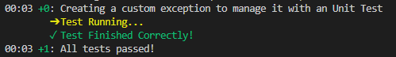

# Tests Samples
> An Unit Test should be `simple`, `deterministic`, `fast`, `focused in a part of code`, `understandable` and `cover all possibilities`

- [`Counter Test`](#counter_test)
- [`Custom Exception Test`](#custom_exception_test)
- [`Exception Test`](#exception_test)
- [`Function Test`](#function_test)

## [**Counter Test**](tests/class_test/test/counter_test.dart)
Counter class with Unit Tests

## [**Custom Exception Test**](tests/custom_exception_test/test/custom_exception_test.dart)
Unit Test about a custom Exception, and a class that throws the custom Exception

## [**Exception Test**](tests/exception_test/test/create_exception_test.dart)
Unit Test about a class that throws an Exception

## [**Function Test**](tests/function_test/test/sum_test.dart)
Sum class with Unit Tests with an initialization method

---
[Home](../README.md)

